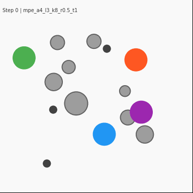
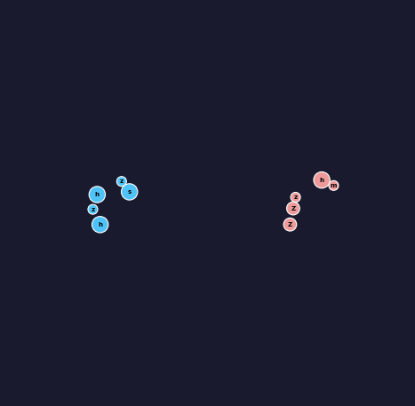

# MEAL: A Benchmark for Continual Multi-Agent Reinforcement Learning

MEAL is the first **Continual Multi‑Agent Reinforcement Learning (CMARL)** benchmark built around cooperative 
Overcooked‑style tasks, implemented in JAX for high‑performance training and evaluation. It focuses on learning over 
extensive sequences of procedurally generated tasks without catastrophic forgetting, across different team sizes, 
difficulty level, and reward settings.

<div align="center">
  <table>
    <tr>
      <th>Overcooked</th><th>MPE</th><th>SMAX</th><th>JaxNav</th>
    </tr>
    <tr>
      <td style="padding: 4px; width: 25%"></td>
      <td style="padding: 4px; width: 25%"></td>
      <td style="padding: 4px; width: 25%"></td>
      <td style="padding: 4px; width: 25%"></td>
    </tr>
  </table>
</div>

## Key Features

- JAX/Flax implementation for scalable, accelerated training
- Procedurally generated cooperative tasks with adjustable difficulty
- Built‑in continual learning regularizers and memory methods
- Multi‑agent baselines: IPPO and MAPPO
- Results tooling: W&B integration, download utilities, and plotting scripts

## Installation

Requires Python 3.10.

```bash
# Create and activate an environment (Conda example)
conda create -n meal python=3.10 -y
conda activate meal

# Install MEAL in editable mode and optional extras
pip install -e .
pip install -e ".[viz]"
pip install -e ".[utils]"

# Optional: GPU acceleration for JAX (pick your CUDA version)
pip install -U "jax[cuda12]" -f https://storage.googleapis.com/jax-releases/jax_cuda_releases.html
# or
pip install -U "jax[cuda11]" -f https://storage.googleapis.com/jax-releases/jax_cuda_releases.html
```

## Quick Start

The single entry point is `experiments/train.py`. It takes the MARL algorithm as the first
argument (`ippo`, `mappo`, `happo`, `vdn`, `qmix`), then the continual-learning method, then
the environment (`overcooked`, `mpe`, `smax`, `jaxnav`) as a subcommand. Outer flags must
come before the `env:...` subcommand token.

### Example: IPPO + EWC on generated medium Overcooked tasks

```bash
python -m experiments.train ippo \
  --cl-method ewc \
  --seq-length 10 \
  --num-agents 2 \
  --num-envs 2048 \
  --num-steps 400 \
  --update-epochs 8 \
  --use-wandb \
  --project MEAL \
  --seed 1 \
  env:overcooked \
  --env.difficulty medium
```

### Example: MAPPO + MAS with CNN encoder and 4 agents

```bash
python -m experiments.train mappo \
  --cl-method mas \
  --encoder cnn \
  --seq-length 8 \
  --num-agents 4 \
  --use-wandb \
  --project MEAL \
  --seed 2 \
  env:overcooked \
  --env.difficulty hard
```

### Example: VDN + EWC on SMAX

```bash
python -m experiments.train vdn \
  --cl-method ewc \
  --seq-length 5 \
  --use-wandb \
  --project MEAL \
  --seed 3 \
  env:smax \
  --env.num-allies 5 \
  --env.num-enemies 5
```

### Running Experiments
For running experiments, please refer to [experiments/README.MD](experiments/README.MD).
To reproduce the experiments from the paper specifically, see
[scripts/README.MD](scripts/README.MD).

## Environments

MEAL benchmarks continual learning across four environments, each with its own README covering
observation/action space, reward structure, how CL task diversity is generated, and every
`--env.*` flag it exposes:

- [Overcooked](meal/env/overcooked/README.md) — cooperative kitchen, procedurally generated layouts
- [MPE](meal/env/mpe/README.md) — particle-agent coverage with obstacles
- [SMAX](meal/env/smax/README.md) — StarCraft-style unit-composition battles
- [JaxNav](meal/env/jaxnav/README.md) — multi-robot 2D navigation

For details on how Overcooked layouts themselves are procedurally generated, see
[meal/README.MD](meal/README.MD).

## Project Structure

- `experiments/`
  - `train.py`: single training entry point (algo x cl-method x env)
  - `algos/`: AbstractAlgo/OnPolicyAlgo/OffPolicyAlgo hierarchy (IPPO, MAPPO, HAPPO, VDN, QMIX)
  - `envs/`: EnvAdapter per environment (Overcooked, MPE, SMAX, JaxNav)
  - `continual/`: implementations of EWC, MAS, L2, FT, AGEM
  - `results/`: W&B downloaders and plotting scripts
- `scripts/`: paper-reproduction sweeps (see [scripts/README.MD](scripts/README.MD)) + env visualization tooling
- `meal/`
  - `env/`: layouts and utilities
  - `wrappers/`: logging and environment wrappers
  - `visualization/`: rendering utilities
- `tests/`: smoke tests and image comparisons

## Acknowledgments

- The Overcooked environment is based on [JaxMARL](https://github.com/FLAIROx/JaxMARL).
- Our experiments were managed using [WandB](https://wandb.ai).

## Citation
If you use our work in your research, please cite it as follows:
```
@article{tomilin2026meal,
  title={MEAL: A Benchmark for Continual Multi-Agent Reinforcement Learning},
  author={Tomilin, Tristan and van den Boogaard, Luka and Garcin, Samuel and Ruhdorfer, Constantin and Grooten, Bram and Kusters, Fabrice and Du, Yali and Bulling, Andreas and Pechenizkiy, Mykola and Fang, Meng},
  booktitle={Proceedings of the 43rd International Conference on Machine Learning (ICML)},
  year={2026}
}
```