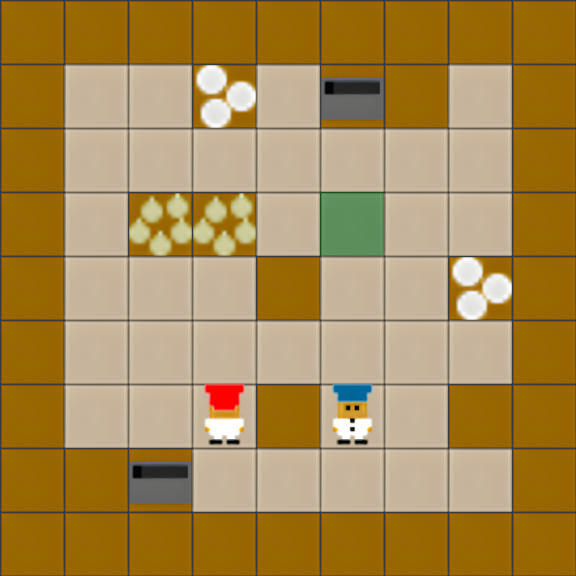

# MEAL: A Benchmark for Continual Multi-Agent Reinforcement Learning

MEAL is the first **Continual Multi‑Agent Reinforcement Learning (CMARL)** benchmark built around cooperative 
Overcooked‑style tasks, implemented in JAX for high‑performance training and evaluation. It focuses on learning over 
extensive sequences of procedurally generated tasks without catastrophic forgetting, across different team sizes, 
difficulty level, and reward settings.

<div align="center">
  <table>
    <tr>
      <td style="padding: 4px; width: 33%"></td>
      <td style="padding: 4px; width: 33%"></td>
      <td style="padding: 4px; width: 33%"></td>
    </tr>
  </table>
</div>

## Key Features

- JAX/Flax implementation for scalable, accelerated training
- Procedurally generated cooperative tasks with adjustable difficulty
- Built‑in continual learning regularizers and memory methods
- Multi‑agent baselines: IPPO and MAPPO
- Results tooling: W&B integration, download utilities, and plotting scripts

## Installation

Requires Python 3.10.

```bash
# Create and activate an environment (Conda example)
conda create -n meal python=3.10 -y
conda activate meal

# Install MEAL in editable mode and optional extras
pip install -e .
pip install -e ".[viz]"
pip install -e ".[utils]"

# Optional: GPU acceleration for JAX (pick your CUDA version)
pip install -U "jax[cuda12]" -f https://storage.googleapis.com/jax-releases/jax_cuda_releases.html
# or
pip install -U "jax[cuda11]" -f https://storage.googleapis.com/jax-releases/jax_cuda_releases.html
```

## Quick Start

The main entry points are:
- IPPO: `experiments/ippo.py`
- MAPPO: `experiments/mappo.py`

### Example: IPPO + EWC on generated medium tasks

```bash
python -m experiments.ippo \
  --cl-method ewc \
  --seq-length 10 \
  --strategy generate \
  --difficulty medium \
  --num-agents 2 \
  --num-envs 2048 \
  --num-steps 400 \
  --update-epochs 8 \
  --use-wandb true \
  --project MEAL \
  --seed 1
```

### Example: MAPPO + MAS with CNN encoder and 4 agents

```bash
python -m experiments.mappo \
  --cl-method mas \
  --use-cnn true \
  --num-agents 4 \
  --seq-length 8 \
  --strategy generate \
  --difficulty hard \
  --use-wandb true \
  --project MEAL \
  --seed 2
```

### Running Experiments
For running experiments, please refer to [experiments/README.MD](experiments/README.MD).

## Environments

MEAL composes continual learning sequences from generated task layouts. The layouts can be created across difficulty levels. 
The level affects the grid size, obstacle density, and severity of non-stationary components. Example layouts:

<div align="center">
  <table>
    <tr>
      <th>Easy</th><th>Medium</th><th>Hard</th>
    </tr>
    <tr>
      <td></td>
      <td></td>
      <td></td>
    </tr>
  </table>
</div>

More details about MEAL environments can be found in [meal/README.MD](meal/README.MD).

## Project Structure

- `experiments/`
  - `ippo.py`, `mappo.py`: training entry points
  - `continual/`: implementations of EWC, MAS, L2, FT, AGEM
  - `results/`: W&B downloaders and plotting scripts
- `meal/`
  - `env/`: layouts and utilities
  - `wrappers/`: logging and environment wrappers
  - `visualization/`: rendering utilities
- `tests/`: smoke tests and image comparisons

## Acknowledgments

- The Overcooked environment is based on [JaxMARL](https://github.com/FLAIROx/JaxMARL).
- Our experiments were managed using [WandB](https://wandb.ai).

## Citation
If you use our work in your research, please cite it as follows:
```
@article{tomilin2025meal,
  title={MEAL: A Benchmark for Continual Multi-Agent Reinforcement Learning},
  author={Tomilin, Tristan and van den Boogaard, Luka and Garcin, Samuel and Ruhdorfer, Constantin and Grooten, Bram and Bulling, Andreas and Pechenizkiy, Mykola and Fang, Meng},
  journal={arXiv preprint arXiv:2406.01234},
  year={2025}
}
```