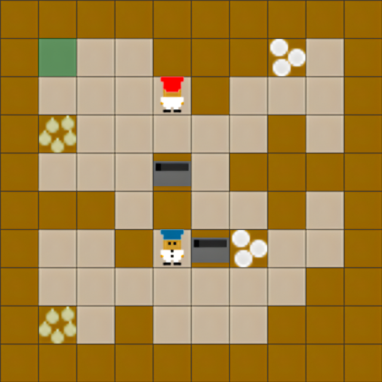

# MEAL: A Benchmark for Continual Multi-Agent Reinforcement Learning

MEAL is the first **Continual Multi-Agent Reinforcement Learning (CMARL)** benchmark, using the Overcooked environment,
implemented in JAX for high-performance training and evaluation. The project focuses on enabling agents to continuously
learn and adapt to new environments without forgetting previously acquired skills.

<div align="center">
  <table style="border-collapse: collapse; border: none;">
    <tr style="border: none;">
      <td style="border: none; padding: 5; width: 33%;">
        
      </td>
      <td style="border: none; padding: 5; width: 33%;">
        
      </td>
      <td style="border: none; padding: 5; width: 30%;">
        
      </td>
    </tr>
  </table>
</div>

## Key Features

- **JAX-based Implementation**: Leverages JAX for efficient, hardware-accelerated training
- **Procedurally Generated Environments**: An infinite stream of solvable, variable‑sized cooperative challenges
- **Visualization**: Tools for analyzing environments and training progress
- **3 Difficulty Levels**: *easy*, *medium*, and *hard*
- **Continual Learning Methods**:
  - Elastic Weight Consolidation (EWC)
  - Online EWC
  - Memory Aware Synapses (MAS)
  - L2 Regularization
  - Fine-Tuning (FT)
  - PackNet
  - Averaged Gradient Episodic Memory (AGEM)
- **Multi-Agent Algorithms**:
  - Independent Proximal Policy Optimization (IPPO)
  - Value Decomposition Networks (VDN)

## Installation

MEAL requires Python 3.10 and uses JAX with CUDA support by default.

### Prerequisites

- Python 3.10
- pip (latest version recommended)
- For GPU acceleration: CUDA 12 compatible hardware and drivers

### Option 1: Using Python venv

1. Create a virtual environment:

```bash
python3.10 -m venv .venv
```

2. Activate the virtual environment:

```bash
# On Linux/macOS
source .venv/bin/activate

# On Windows
.venv\Scripts\activate
```

3. Install the package:

```bash
# Install in development mode with all extras
pip install -e ".[all]"

# Or install only core dependencies
pip install -e .
```

### Option 2: Using Conda

1. Create and activate a conda environment:

```bash
# Create environment
conda create -n meal python=3.10

# Activate environment
conda activate meal

# Install in development mode with all extras
pip install -e ".[all]"
```

### Installation Options

MEAL provides several installation options through extras:

- **Core installation**: `pip install -e .`
- **With visualization tools**: `pip install -e ".[viz]"`
- **With development tools**: `pip install -e ".[dev]"`
- **With utility tools**: `pip install -e ".[utils]"`
- **Complete installation**: `pip install -e ".[all]"`

### Platform-Specific Instructions

#### For macOS Users

macOS doesn't support CUDA, so you need to install without CUDA support:

```bash
# First install without CUDA
pip install jax

# Then install MEAL (it will skip the CUDA dependency)
pip install -e ".[all]"
```

#### For CPU-only Installation

If you don't have a compatible GPU or prefer to run on CPU:

```bash
# First install JAX without CUDA
pip install jax

# Then install MEAL
pip install -e ".[all]"
```


## Usage

### Running IPPO with Continual Learning

```bash
# Run IPPO with Elastic Weight Consolidation (EWC)
python -m baselines.IPPO_CL --cl_method EWC
```

### Environment Generation

MEAL includes tools for generating new Overcooked layouts:

```bash
# Generate a random environment
python -m jax_marl.environments.overcooked_environment.env_generator --save

# Visualize environment generation steps
python -m jax_marl.environments.overcooked_environment.env_generator --show

# Generate step-by-step visualization images
python -m jax_marl.viz.env_gen_steps --difficulty medium
```

Example of environment generation steps (generated using `jax_marl.viz.env_gen_steps`):

<div align="center">
  <table>
    <tr>
      <th>Step 1: Initialize Grid</th>
      <th>Step 2: Place Interactive Tiles</th>
      <th>Step 3: Add Walls</th>
      <th>Step 4: Place Agents & Clean Up</th>
    </tr>
    <tr>
      <td></td>
      <td></td>
      <td></td>
      <td></td>
    </tr>
    <tr>
      <td>Create empty grid with border walls</td>
      <td>Add goal, pot, onion pile, and plate pile</td>
      <td>Add additional walls to reach target density</td>
      <td>Place agents and remove unreachable areas</td>
    </tr>
  </table>
</div>


## Environment Difficulty

MEAL generates layouts with varying difficulty levels to test agent adaptability: The following images illustrate
the different layouts:

<div align="center">
  <table>
    <tr>
      <th>Easy Layout</th>
      <th>Medium Layout</th>
      <th>Hard Layout</th>
    </tr>
    <tr>
      <td></td>
      <td></td>
      <td></td>
    </tr>
  </table>
</div>

The difficulty of layouts is determined by the following criteria:

<div align="center">
  <table>
    <tr>
      <th>Difficulty Level</th>
      <th>Grid Width</th>
      <th>Grid Height</th>
      <th>Obstacle Density</th>
    </tr>
    <tr>
      <td>Easy</td>
      <td>6-7</td>
      <td>6-7</td>
      <td>15%</td>
    </tr>
    <tr>
      <td>Medium</td>
      <td>8-9</td>
      <td>8-9</td>
      <td>25%</td>
    </tr>
    <tr>
      <td>Hard</td>
      <td>10-11</td>
      <td>10-11</td>
      <td>35%</td>
    </tr>
  </table>
</div>

## Project Structure

- **architectures/**: Neural network architectures (MLP, CNN)
- **assets/**: Screenshots, GIFs, and other assets
    - **gifs/**: Example training progress GIFs
    - **screenshots/**: Example environment layouts and training results
- **baselines/**: Implementation of baseline algorithms (IPPO, VDN)
- **cl_methods/**: Continual learning method implementations
- **jax_marl/**: Core JAX MARL framework
    - **environments/**: Environment implementations, including Overcooked
    - **tests/**: Test files
    - **viz/**: Visualization tools
    - **wrappers/**: Environment wrappers
- **results/**: Experimental results and plotting tools
    - **download/**: Scripts for downloading and processing results
    - **plotting/**: Plotting scripts for training results
    - **numerical/**: Numerical results and analysis

## Contributing

Contributions to MEAL are welcome! Please feel free to submit a Pull Request.

## License

This project is licensed under the MIT License - see the LICENSE file for details.

## Acknowledgments

- The Overcooked environment is based on [JaxMARL](https://github.com/FLAIROx/JaxMARL).
- Our experiments were managed using [WandB](https://wandb.ai).


## Citation
If you use our work in your research, please cite it as follows:
```
@article{tomilin2025meal,
  title={MEAL: A Benchmark for Continual Multi-Agent Reinforcement Learning},
  author={Tomilin, Tristan and van den Boogaard, Luka and Garcin, Samuel and Grooten, Bram and Fang, Meng and Pechenizkiy, Mykola},
  journal={arXiv preprint arXiv:2406.01234},
  year={2025}
}
```