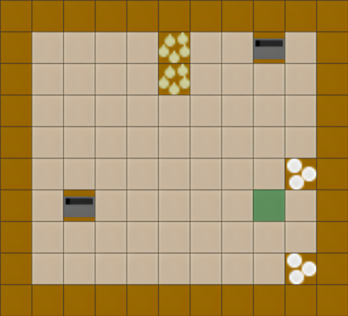
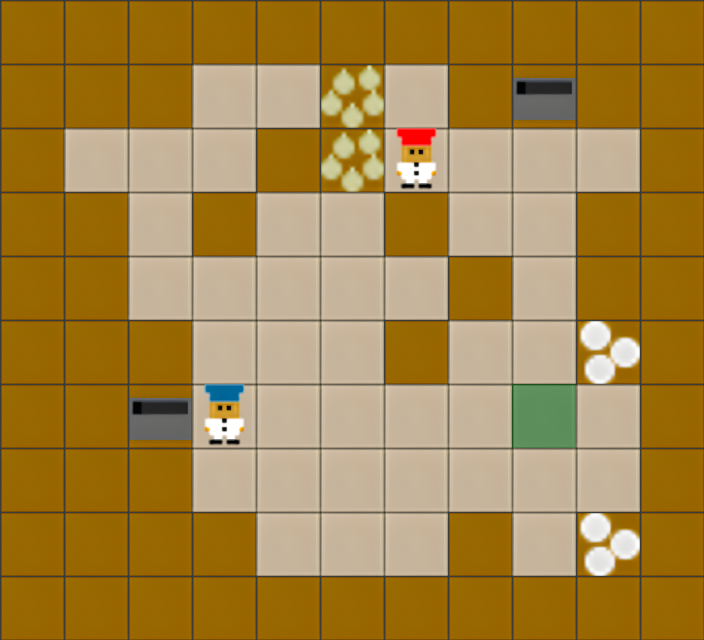

# Environment Generation

Generating new Overcooked layouts:

```bash
# Generate and visualize a random environment
python -m meal.env.generation.layout_generator --show

# Generate and store the visualization of a random medium environment
python -m meal.env.generation.layout_generator --save --difficulty medium
```

Example of environment generation steps

<div align="center">
  <table>
    <tr>
      <th>Step 1: Initialize Grid</th>
      <th>Step 2: Place Interactive Tiles</th>
      <th>Step 3: Add Walls</th>
      <th>Step 4: Place Agents & Clean Up</th>
    </tr>
    <tr>
      <td></td>
      <td></td>
      <td></td>
      <td></td>
    </tr>
    <tr>
      <td>Create empty grid with border walls</td>
      <td>Add goal, pot, onion pile, and plate pile</td>
      <td>Add additional walls to reach target density</td>
      <td>Place agents and remove unreachable areas</td>
    </tr>
  </table>
</div>

## Difficulty Levels
The difficulty of layouts is determined by the following criteria:

<div align="center">
  <table>
    <tr>
      <th>Difficulty Level</th>
      <th>Grid Width</th>
      <th>Grid Height</th>
      <th>Obstacle Density</th>
    </tr>
    <tr>
      <td>Easy</td>
      <td>6-7</td>
      <td>6-7</td>
      <td>15%</td>
    </tr>
    <tr>
      <td>Medium</td>
      <td>8-9</td>
      <td>8-9</td>
      <td>25%</td>
    </tr>
    <tr>
      <td>Hard</td>
      <td>10-11</td>
      <td>10-11</td>
      <td>35%</td>
    </tr>
  </table>
</div>