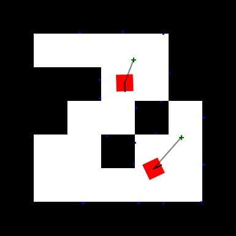

# JaxNav

2D robot navigation environment: `num_agents` differential-drive robots must navigate a
polygon-obstacle map from their start position to an assigned goal without colliding with
walls, obstacles, or each other. Continuous underlying dynamics (position, heading, velocity)
with a discretized action space in the version wired into `experiments/`.



## Observation / action space

Each robot observes its own kinematic state (position, heading, velocity) plus range-finder
/ lidar-style readings of nearby obstacles and other agents, and relative goal direction.
Action space (`act_type="Discrete"`) is a discretized set of `(linear velocity, angular
velocity)` commands.

## Reward

Reward is split into `sparse` and `dense` components (see `Reward`/`listify_reward` in
`jaxnav_env.py`): dense reward is a step-wise shaping signal (progress toward goal, obstacle
proximity penalty), sparse reward is a terminal bonus/penalty for reaching the goal vs.
crashing vs. timing out. An episode ends per-agent on goal-reach, collision, or timeout;
`info["GoalR"]` (newly-reached-goal flag this step) and `info["NumC"]` (episode just
concluded, for any reason) drive the `Evaluation/Success` metric (fraction of concluded
episodes that ended in a reached goal rather than a crash/timeout).

## How a task sequence is built

Each task is the same `Grid-Rand-Poly` map type (randomly placed polygonal obstacles on a
`map_dim × map_dim` grid) with a freshly sampled obstacle layout per task
(`make_jaxnav_sequence` in `experiments/envs/jaxnav.py` — this sequence-building logic lives
in `experiments/` rather than in this package, unlike Overcooked/MPE/SMAX). Map dimensions and
agent count are fixed across the sequence so every task shares identical observation/state
shapes.

## Parameters (`--env.*` under `env:jaxnav`)

| Flag | Default | Effect |
|---|---|---|
| `--num-agents` (top-level, shared) | 2 | Number of robots. |
| `--env.map-dim` | 7 | Side length of the square map grid; larger maps mean more open space and longer paths to the goal. |
| `--env.partial-observability` | `False` | Not yet implemented — raises `NotImplementedError`. |
| `--repeat-sequence` (top-level, shared) | 1 | Replay the whole task sequence back-to-back this many times. |
| `--max-episode-steps` (top-level, shared) | 400 | Episode length. |

Video recording (`--record-video`) for JaxNav is decorative/debug-only: it replays a
**random** policy on the map (`rollout_jaxnav_random`), not the trained agent — useful for
sanity-checking generated maps, not for inspecting trained behavior.

## Example

```bash
python -m experiments.train ippo --cl-method l2 --seq-length 6 --num-agents 3 \
  env:jaxnav --env.map-dim 9
```
