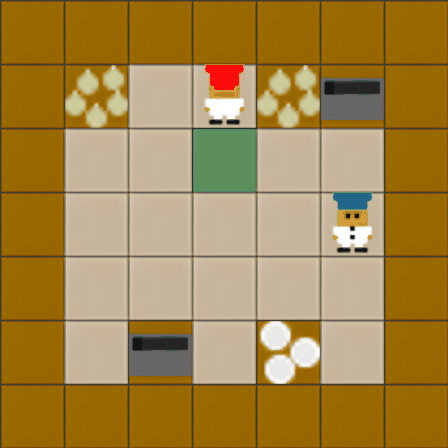
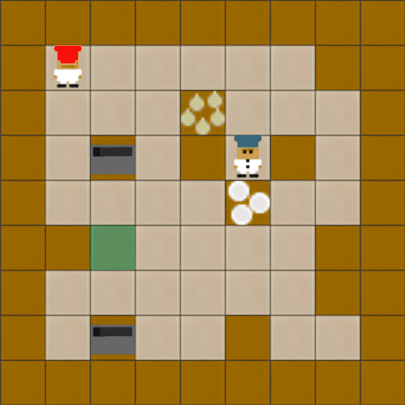
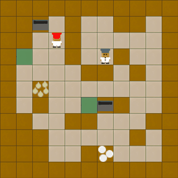
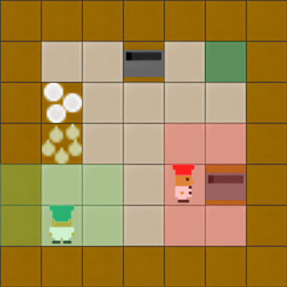
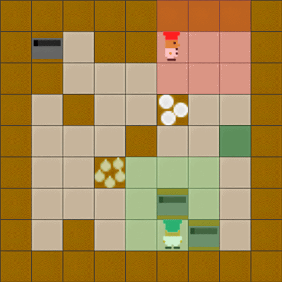
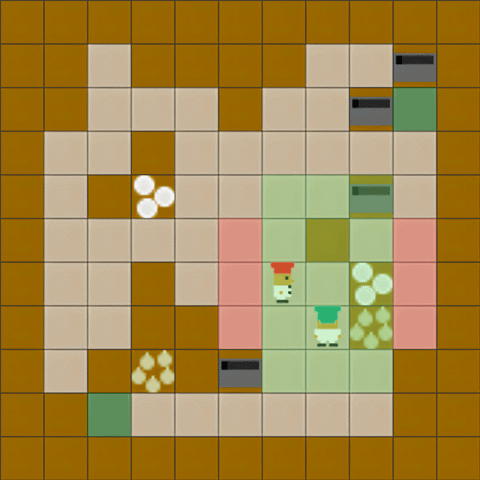
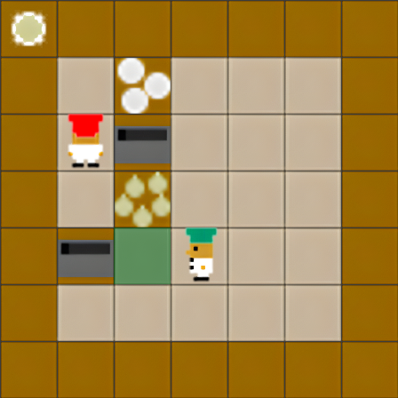

# Overcooked

Cooperative kitchen environment: `num_agents` agents move around a procedurally generated
grid, collect onions, cook them into soup in pots, plate the soup, and deliver it for reward.
The classic multi-agent credit-assignment/coordination benchmark, extended here for
**continual learning** — a training run is a *sequence* of distinct kitchen layouts, and the
policy is trained on them one after another.

<div align="center">
  <table>
    <tr>
      <th>Easy</th><th>Medium</th><th>Hard</th>
    </tr>
    <tr>
      <td></td>
      <td></td>
      <td></td>
    </tr>
  </table>
</div>

## Observation / action space

- Observation: `(width, height, channels)` grid tensor. Channels encode walls, agent
  positions/orientations, held items, pot contents/cook-progress, onion/plate piles, and the
  delivery goal. Fully observable by default (`partial_observability=False`); see below.
- Action space: 6 discrete actions — `up`, `down`, `right`, `left`, `stay`, `interact`.
- Reward: `+20` (`DELIVERY_REWARD`) shared or split depending on `individual_rewards`, when a
  soup is delivered, plus an annealed shaping bonus (see **Reward shaping** below) that
  decays to 0 over roughly half of `steps_per_task`.

## How a task sequence is built

Each task in a sequence is an independently procedurally generated kitchen (`strategy` is
always `"generate"` — the legacy `"random"`/`"ordered"`/`"curriculum"` layout-pool strategies
still exist in `generation/sequence_loader.py` but aren't exposed on the CLI). Generation
(`generation/layout_generator.py`) places walls, pots, onion/plate piles and the goal on a
`height × width` grid at `difficulty`-dependent density, validates the layout is solvable
(`generation/layout_validator.py` — every station reachable, at least one valid delivery
path), and retries with a fresh random seed until a valid layout is found.

## Parameters (`--env.*` under `env:overcooked`)

| Flag | Default | Effect |
|---|---|---|
| `--env.difficulty` | `easy` | One of `easy`/`medium`/`hard`/`extreme`. Controls grid size, wall density, number of pots/stations, and (see below) partial-observability view size and non-stationarity strengths. See `difficulty_config.py` for exact numbers per level. |
| `--num-agents` (top-level, shared) | 2 | Team size. |
| `--repeat-sequence` (top-level, shared) | 1 | Replay the whole generated task sequence back-to-back this many times. |
| `--max-episode-steps` (top-level, shared) | 400 | Episode length. |
| `--env.random-reset` | `False` | If set, every episode reset randomizes agent positions, inventories, pot contents, and counter items. If unset, only a fixed layout-defined spawn is used and pots/counters reset empty. |
| `--env.complementary-restrictions` | `False` | 2-agent only. One agent can't pick up onions, the other can't pick up plates — forces role specialization/cooperation. |
| `--env.separated-agents` | `False` | Only accept generated layouts where agents start in different connected regions of the grid. |
| `--env.partial-observability` | `False` | Agents see only a local window facing their orientation (size set by `difficulty`'s `view_ahead`/`view_sides`/`view_behind`) instead of the full grid. Implemented via `OvercookedPO` (`overcooked_po.py`). |
| `--env.sticky-actions` | `False` | Each action has a `difficulty`-dependent probability (`repeat_action_prob`) of being repeated instead of executed as intended. |
| `--env.slippery-tiles` | `False` | Some tiles randomly divert agent movement, with `difficulty`-dependent probability (`slipping_prob`). |
| `--env.random-pot-size` | `False` | Randomize how many onions a pot needs to start cooking. |
| `--env.random-cook-time` | `False` | Randomize cook duration per pot. |
| `--env.non-stationary` | `False` | Shortcut that enables all 4 of the above (`sticky_actions`, `slippery_tiles`, `random_pot_size`, `random_cook_time`) at once — simulates a kitchen whose dynamics drift over time. |
| `--env.sparse-rewards` | `False` | Only the shared soup-delivery reward, no shaping bonus at all. Mutually exclusive with `individual_rewards`. |
| `--env.individual-rewards` | `False` | Each agent only receives reward for its own actions (no shared team reward). Mutually exclusive with `sparse_rewards`. |

### Reward shaping

By default (`sparse_rewards=False`, `individual_rewards=False`), agents get a shared delivery
reward plus a per-step shaping bonus (`info["shaped_reward"]` — small rewards for useful
sub-actions like picking up an onion or placing it in a pot) that's linearly annealed to zero
over the first half of `steps_per_task`, encouraging exploration early and pure task reward
later.

## Non-stationarity vs. partial observability

These are orthogonal: `non_stationary` changes the environment's *dynamics* (how actions map
to outcomes) mid-training within a task, while `partial_observability` changes what each agent
*sees* (full grid vs. local window). Both can be combined.

### Partial observability (`--env.partial-observability`)

View size grows with `--env.difficulty` (`view_ahead`/`view_sides`/`view_behind` in
`difficulty_config.py`), so higher difficulty gives agents a larger local window:

<div align="center">
  <table>
    <tr>
      <th>Easy</th><th>Medium</th><th>Hard</th>
    </tr>
    <tr>
      <td></td>
      <td></td>
      <td></td>
    </tr>
  </table>
</div>

### Forced agent separation (`--env.separated-agents`)

Generated layout where agents start in disconnected regions, forcing them to coordinate
through a shared pass-through point rather than moving freely around each other:



## Example

```bash
python -m experiments.train ippo --cl-method ewc --seq-length 10 --num-agents 2 \
  env:overcooked --env.difficulty medium --env.non-stationary
```
